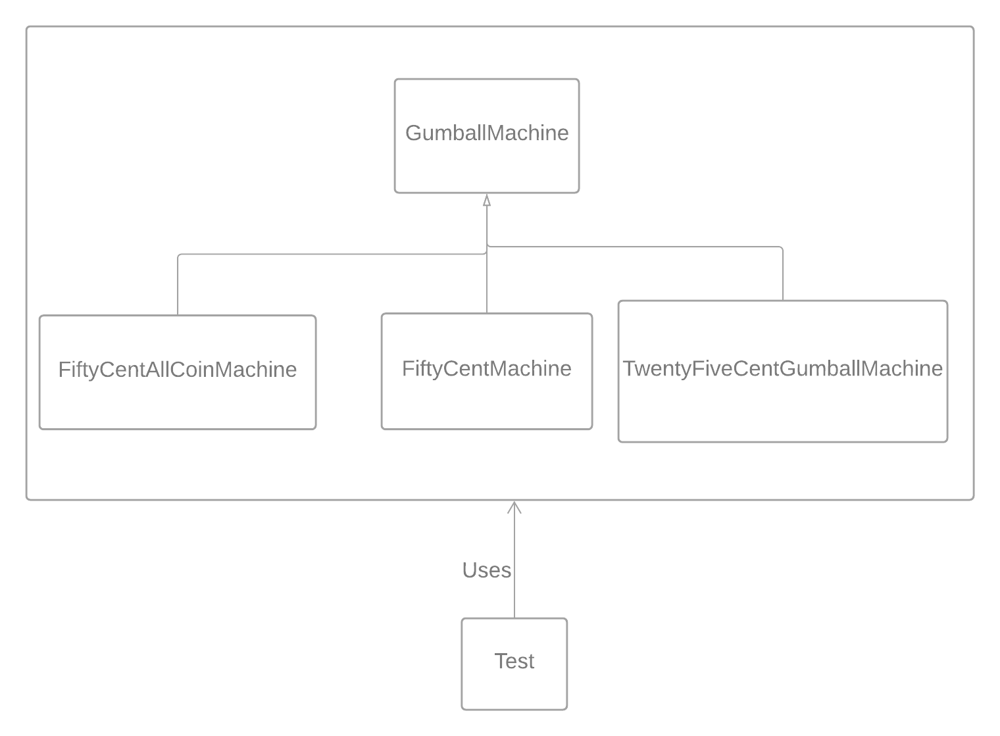
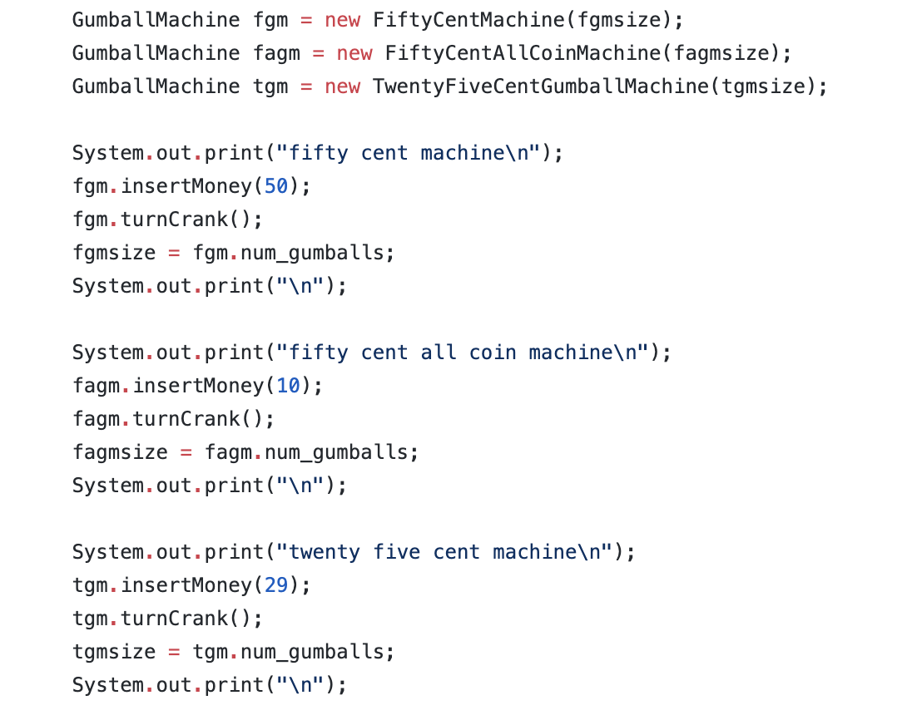
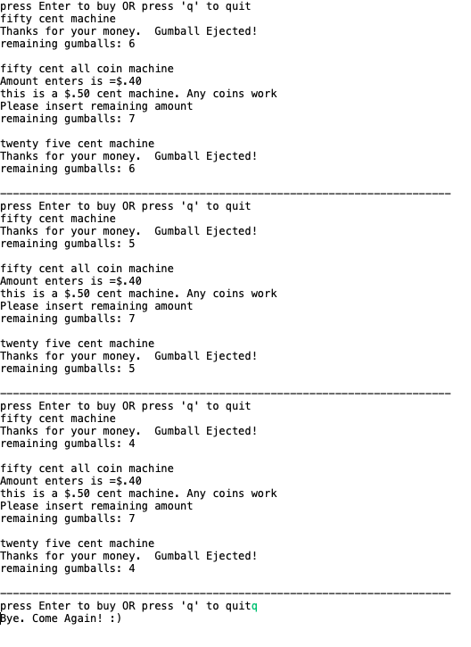

# GumBall-Machine
Generalization Example by demonstrating Gum ball Machine

<h2>Class Diagram</h2>

<h4>Generalization</h4> 
<ul>
  <li>FiftyCentAllCoinMachine, FiftyCentMachine, TwentyFiveCentGumballMachine are all generalized as a GumballMachine</li> 
  <li>All these 3 classes extend the GumballMachine class.</li> 
  <li>override the insertMoney(..) all these three classes as per requirement.</li> 
  </ul> 
  
  <h4>Test.java program</h4> 
  <ul>
  <li> Test.java uses the generalized GumballMachine. </li> 
  <li> Create instances of FiftyCentAllCoinMachine, FiftyCentMachine, TwentyFiveCentGumballMachine here </li> 
  <li> Call the super constructor of all the classes while creating the instances </li> 
  <li> Run the app </li> 

<h2>Output of the application</h2>

<h4>input data</h4>

<ul>
  <li>All three machine have 7 gumballs</li> 
  <li>insertmoney()shows the amount of money inserted</li> 
  <li>System is updated by relevant print statements as per coins inserted and also keeps count of gumballs</li> 
  </ul>

<h4>output</h4>

